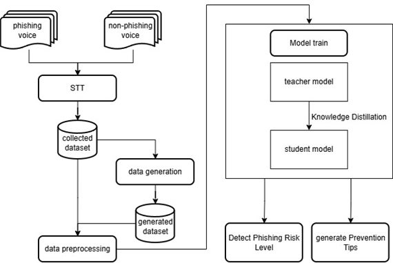

# 🔒 Capstone: Voice Phishing Detection (텍스트 기반 보이스피싱 탐지 시스템 개발)

서울과학기술대학교 인공지능응용학과 **캡스톤디자인** 과목 졸업 프로젝트

# 📊 데이터 전처리

- **Dataset:** KorCCVi Dataset (보이스피싱/일반 대화, 2.1 version)

- **데이터 개수**
  - 일반 대화: 2,232개  
  - 피싱 대화: 695개  

### Task 1 — Role Insertion  
> 이미 제거된 화자 식별자(`피해자 :`, `사기범 :`)를 다시 삽입하는 과정

- 파일: `role_insertion.py`  
- 입력: label = 1 (피싱 데이터)  
- 출력: 화자 태그가 복원된 텍스트 파일  

---

### Task 2 — Role Deletion  
> label=1 데이터(피싱 데이터) 중 **피해자 대화 내용을 삭제**

- 파일: `role_deletion.py`  
- 입력: label = 1 (피싱 데이터)  
- 출력: 사기범 대사만 남은 텍스트 파일  

---

###  데이터 확인 코드
```python
import pandas as pd

df = pd.read_csv("data.csv")

# label=1 (피싱 데이터)만 확인
df_label1 = df[df["label"] == 1]
print(df_label1.head())
```

## 👥 역할 분담

| 담당자 | 역할 |
|--------|----------------------|
| 김나현 |  코드 리뷰 및 통합 담당 (코드 리펙토링 및 파일 구조 통일) |
| 장수효 | `role_deletion.py` 구현 |
| 정지훈 | `role_insertion.py` 구현 |

> ⚠️ `/3` 분할 방식은 비효율적이라 현재는 개별 코드 구현 중심으로 진행


# 아키텍처 (초안)


# 깃허브 사용법 (예시)

저장소 루트로 이동해서 클론하는거까지는 따로 작성하진 않겠습니다!!
아래 예시는 맨 처음 기준이라 브랜치 생성하면 거기서 계속 수정하면 되고
수정하기전 계속 원격 상태 확인하셔야합니다!! (pull해서)

0) 최신 원격 상태(main) 가져오기(안전)

```bash
git fetch origin
```

```bash
git pull origin main
``` 

1) 브랜치 생성 및 이동

```bash
git checkout -b dev-db-kim
```


2) 변경 파일 확인

```bash
git status
```

3) 스테이징

```bash
git add data/preprocessing.py
```

4) 커밋 (변경 요약을 규칙에 맞게)

```bash
git commit -m "전처리 스크립트 초기 추가"

```

5) 원격 푸시 

```bash
git push --set-upstream origin dev-db-kim

```

## 커밋 메시지 규칙

- 간단·명료한 개조식

- 마침표 생략

- 여러 작업은 커밋 분리

## PR 규칙

- PR 제목: 변경 요약 한 줄

- PR 본문 템플릿 사용(개요/변경 사항/기타)
